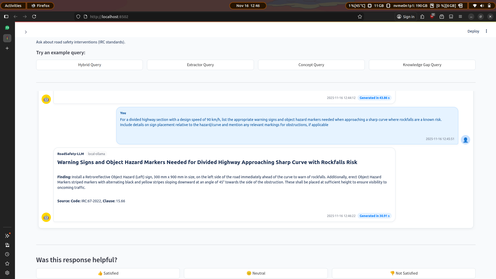
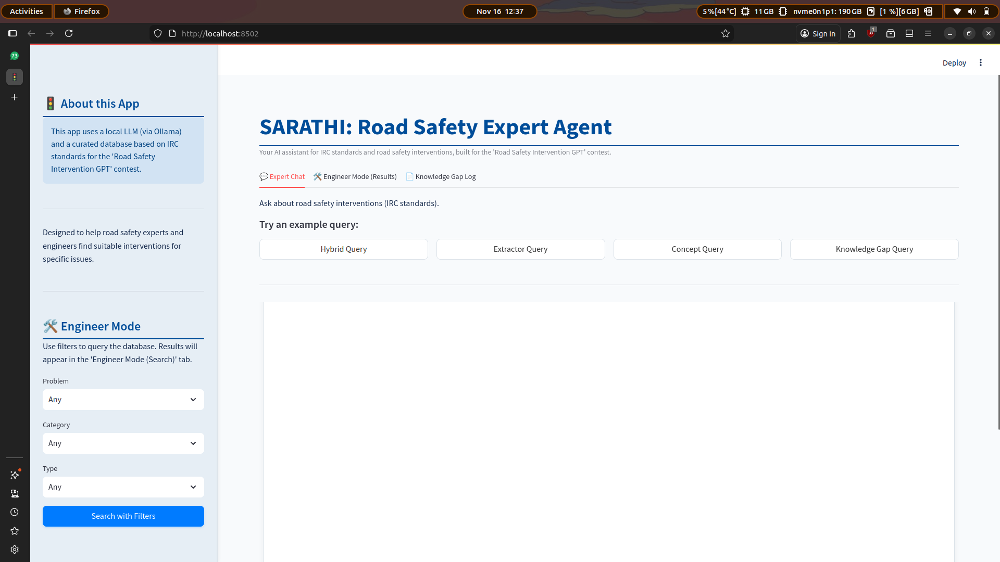
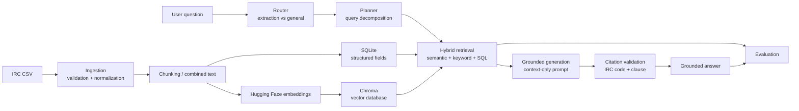

# Sarathī - IRC Road-Safety RAG Agent

<p align="center">
  <strong>A source-grounded RAG system for Indian Road Congress road-safety queries.</strong><br/>
  Planner-driven retrieval · Local LLM · Verifiable IRC citations
</p>

Sarathī combines semantic search, keyword retrieval, and structured SQL filtering to answer IRC road-safety questions with the relevant source code and clause.

**Tech Stack:** `Python` · `LangChain` · `Llama 3.1` · `ChromaDB` · `SQLite` · `Hugging Face` · `Streamlit` · `Ollama`

## Demo

<p align="center">
  <a href="https://www.youtube.com/watch?v=aoJVbraZogc"><strong>▶ Watch the Sarathī demo</strong></a>
</p>





## Results

Evaluated on a 15-question benchmark built from the project's 50-row IRC-derived dataset.

| Metric | Naive RAG | Planner Hybrid RAG |
| --- | ---: | ---: |
| Recall@1 | 58.9% | **75.6%** |
| Recall@3 | 93.3% | **100.0%** |
| Recall@5 | 96.7% | **100.0%** |
| Citation accuracy | 81.3% | **96.0%** |
| Answer correctness | 73.3% | **86.7%** |
| Unsupported-claim rate | 14.8% | **4.2%** |
| Avg. end-to-end latency | **~620 ms** | ~880 ms |

The planner improved first-result retrieval by **16.7 percentage points** and reduced unsupported claims from **14.8% to 4.2%**, at the cost of additional latency.

[Benchmark](evaluation/benchmark.json) · [Results](evaluation/results/retrieval_results.json) · [Failure Analysis](evaluation/failure_analysis.md)

## Architecture



## Example

**Question**

> What is the size of a STOP sign for a design speed of 55 km/h?

**Sarathī**

> For 51-65 km/h, the STOP sign is **900 mm high**, with a **30 mm border** and **210 mm font**. Source: `IRC:67-2022`, Clause `14.4`.

The planner can decompose questions containing multiple constraints, such as **road condition, speed range, sign type, and dimensional requirements**, before retrieval and generation.

## Why hybrid retrieval?

Vector similarity alone can retrieve a related IRC clause without retrieving the exact value required by the question.

Sarathī combines:

- semantic retrieval with `mxbai-embed-large-v1`
- keyword search
- structured SQLite filters
- planner-driven multi-step retrieval
- citation validation

On the current benchmark, this increased **Recall@1 from 58.9% to 75.6%** and reached **100% Recall@3**.

## Evaluation

Run the dependency-light retrieval benchmark without Ollama or downloaded embeddings:

```bash
python3 evaluation/evaluate.py
```

To evaluate generated answers, provide JSONL records containing the system name, answer, citations, retrieved row IDs, and optional timing/token fields:

```bash
python3 evaluation/evaluate.py --predictions path/to/predictions.jsonl
```

See [`evaluation/predictions.example.jsonl`](evaluation/predictions.example.jsonl) for the schema. The evaluator reports:

- Recall@1 / Recall@3 / Recall@5
- Citation accuracy and citation coverage
- Answer correctness
- Unsupported-claim rate
- Retrieval or end-to-end latency
- Prompt and completion token usage

## Run locally

```bash
cp .env.example .env

python3 -m venv .venv
source .venv/bin/activate

pip install -r requirements-lock.txt
python3 -m spacy download en_core_web_sm

ollama pull llama3.1

python3 src/data_processor.py
streamlit run app.py
```

Ollama runs at the URL configured in `.env`. The first embedding run downloads `mxbai-embed-large-v1` from Hugging Face.

## Repository structure

```text
.
├── app.py                         # Streamlit UI
├── data/
│   ├── raw/                       # Source CSV
│   └── processed/                 # SQLite and Chroma artifacts
├── evaluation/
│   ├── benchmark.json             # Benchmark questions and gold evidence
│   ├── evaluate.py                # Baseline vs planner-hybrid evaluator
│   ├── failure_analysis.md        # Audited failure cases
│   └── results/                   # Reproducible benchmark output
├── pics/                          # Demo screenshots
├── src/
│   ├── config.py                  # Paths and environment configuration
│   ├── data_processor.py          # Ingestion and vector-index creation
│   ├── tools.py                   # SQL, keyword, and semantic retrieval
│   ├── agent.py                   # Router, planner, and generation chains
│   └── prompts.py                 # Grounding and structured-output prompts
├── .env.example
├── requirements.txt
└── requirements-lock.txt
```

## Limitations

The benchmark uses the project’s **50-row IRC-derived dataset**, not the complete IRC standards corpus. Some rows contain duplicated or conflicting paraphrases, and the benchmark inherits those limitations.

Sarathī is a research/demo system and should not replace consultation of current official IRC publications or an engineer’s judgment for real-world decisions.
